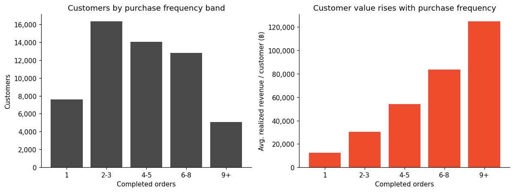
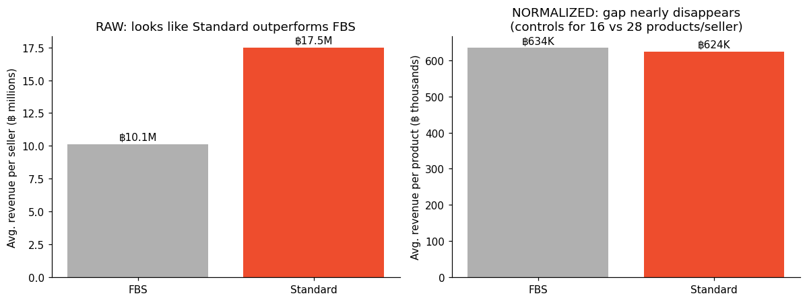

🇬🇧 English ・ [🇯🇵 日本語版はこちら](README.ja.md)

---

# Using AI to Accelerate E-commerce Business Analysis

**[SQL](sql/) · [Notebook](analysis/customer_product_analysis.ipynb) · [Dashboard](dashboard/index.html) · [One-page summary](presentation/summary.md) · [Data notes](data/README.md)**

*[日本語で読む](README.ja.md)*

A customer and product analysis project for an e-commerce business, built to show how I actually
work: define a business question, use AI to accelerate the mechanical parts of analysis, and rely
on my own judgment to validate, challenge, and interpret what the data actually supports.

## Business Question

If I were responsible for growing this e-commerce business:

> **Which customer behaviors, product categories, and seller characteristics should receive
> priority to increase customer value?**

**The short version:** customers with 6+ completed orders are ~32% of the customer base but
generate ~55.7% of realized revenue — purchase frequency, not category preference or seller type,
turned out to be what actually differentiates customer value. The reasoning, validation, and full
findings behind that are below.

Rather than starting from a predefined segmentation framework, I used the data itself to determine
which dimensions were actually useful for understanding differences in customer value — and used
AI as a working partner to move faster through that process, while keeping the analytical
decisions my own.

---

## AI-Assisted Analysis Workflow

I used AI (Claude) as an analytical copilot throughout this project — to draft SQL faster,
explore the data, generate validation checklists, build visualizations, and organize
documentation. It did not replace the analytical thinking; it accelerated the parts of the work
that are mechanical so I could spend more time on validation and interpretation.

**AI-assisted:**
- Business-question exploration and framing
- SQL query drafting
- Data-validation checklist generation
- Exploratory analysis and distribution checks
- Visualization development (charts, dashboard)
- Documentation and synthesis

**Human-controlled:**
- Defining the business question
- Choosing metric definitions (e.g. what counts as "realized revenue")
- Validating data quality and catching confounders
- Selecting the analytical method (and rejecting ones that didn't fit)
- Interpreting what a finding does and doesn't support
- Final business recommendations

Three examples from this project show what that division of labor actually looked like.

### Example 1 — Choosing how to segment customers

An initial additive RFM scoring approach (Recency + Frequency + Monetary, each scored 1–5) was
drafted and tested first. Checking the actual distribution showed that Frequency was highly
discrete (a small set of integers, heavily clustered at low values), which made standard quintile
scoring produce uneven, hard-to-interpret groups — and, more importantly, testing showed the
additive score placed newly-registered customers and one-time high-spend customers into the same
"high value" tier as genuinely repeat customers. That's a business-interpretability problem, not
just a statistical one. I replaced it with behavior-based frequency bands grounded in the actual
purchase-count distribution.

The point isn't "the AI was wrong." AI helped generate and draft both approaches quickly; deciding
which one actually fit the data and the business question was my call, made by checking the
distributions and the edge cases myself.

### Example 2 — FBS vs Standard sellers

A raw comparison initially showed Standard sellers generating substantially more revenue per
seller than FBS sellers. Before accepting that, I checked whether the two seller groups were
otherwise comparable — and found a deterministic catalog-size difference baked into the dataset:
FBS sellers carry exactly 16 products each, Standard sellers carry exactly 28. Raw seller revenue
was therefore the wrong metric to compare logistics performance; revenue per product was used
instead, and the apparent gap nearly disappeared (~฿634K vs ~฿624K per product).

This is the example I'd point to first in an interview: the first analytical output looked like a
clear finding, and it would have been easy to accept it. Checking the data structure before
trusting the number is what turned a misleading conclusion into a correct one.

### Example 3 — Electronics repeat rate

Electronics initially looked like it might have a retention problem — its within-category repeat
rate (41.1%) was much lower than Home's (75.5%). Looking closer, Electronics buyers actually had
*higher* overall purchase frequency and monetary value than Home buyers, and the gap between
purchases within Electronics was structurally longer — consistent with a durable-goods category
that people simply don't rebuy often, not with disengaged customers. I did not label Electronics a
retention problem based on the first number; I checked what the customers behind that number
actually looked like.

---

## What AI Changed

AI was most useful for accelerating repetitive SQL drafting, generating alternative analytical
approaches to compare, surfacing edge cases worth validating, structuring documentation, and
iterating quickly on visualizations. Concretely, it reduced the amount of repetitive execution and
write-up, allowing more time to be spent on validation and business reasoning.

What stayed with me throughout: deciding what the business question actually was, deciding which
metrics were appropriate for that question, checking whether the underlying assumptions held up,
rejecting comparisons that turned out to be misleading (like raw FBS/Standard revenue), and
judging whether a finding was strong enough to support a recommendation. AI didn't make any of
those calls — it made it faster to test them.

---

## Dataset

The dataset is **synthetic e-commerce transaction data modeled on the Shopee Thailand context** —
not actual Shopee transaction records. It covers approximately four years (2022–2025) and was
built as a sample dataset for practicing analysis methods and business reasoning, not to reproduce
the real scale of the platform. At 300,000 orders and 200 sellers over four years, this dataset is
far smaller than Shopee Thailand's actual order and seller volume, and none of the findings below
should be read as claims about Shopee's real business or the Thai e-commerce market as a whole.

| Data | Scale |
|---|---:|
| Customers | 60,000 |
| Orders | 300,000 |
| Completed-order customers | 55,822 |
| Sellers | 200 |
| Observation period | 2022–2025 |

The analysis uses customer, order, order-item, product, and seller data. Source:
[Shopee TH: Customer Journey & Operations Dataset](https://www.kaggle.com/datasets/hninshwezinhlaing/shopee-th-customer-journey-and-operations-dataset)
(Kaggle, by Hnin Shwe Zin Hlaing) — see [data/README.md](data/README.md) for full table-level detail.

### Revenue definition

A data-quality check early on shaped the entire analysis: `orders.total_amount` includes items
that were later cancelled or refunded, so it does not represent realized revenue. For this
project, customer value and revenue metrics are based on **completed order items only** — this
prevents cancelled and refunded purchases from being counted as actual customer value.

---

## Analytical Approach

1. Validate the data and define realized revenue
2. Segment customers based on purchasing behavior
3. Examine the relationship between purchase frequency and customer value
4. Analyze category and product purchasing patterns
5. Analyze seller characteristics and performance
6. Identify potential confounders before interpreting differences
7. Translate the findings into business recommendations

Every step above was accelerated with AI assistance for drafting and iteration; every decision
about method, validity, and interpretation was mine.

---

# 1. Customer Analysis

## Customer Segmentation

I initially considered a standard additive RFM score. Testing showed that a pure RFM score could
place newly registered customers and one-time high-spend customers into the same high-value tier
as genuinely repeat customers (see Example 1 above). I therefore used a business-rule approach
that explicitly considered purchase frequency, recency, customer tenure, and one-time vs. repeat
purchasing behavior. Recently registered customers were kept separate from established customers
to avoid confusing a short observation window with low engagement.

### Key Finding

**Purchase frequency showed the strongest and most consistent association with customer value in
the analysis.**

Customers with 6+ completed orders represented approximately **32% of customers but generated
55.7% of realized revenue**.

Average realized revenue per customer increased consistently with purchase frequency:

| Completed Orders | Avg. Revenue / Customer |
|---:|---:|
| 1 | ฿12,366 |
| 2–3 | ฿30,521 |
| 4–5 | ฿54,227 |
| 6–8 | ฿83,616 |
| 9+ | ฿124,741 |

Average revenue per customer increased consistently across every frequency band rather than being
concentrated in a single high-value group.



---

# 2. Category & Product Analysis

The next question was whether high-value customers were concentrated around particular categories
or products.

Home and Electronics accounted for approximately **96.2% of realized revenue**. However, high-value
customer groups did not show meaningful category affinity — category-level and product-level
over-index analysis (tested down to individual products with at least 100 purchasing customers)
produced ratios close to the overall baseline, with no meaningful concentration among high-value
customers.

### Key Finding

**Customer value was not associated with a distinctive category or product mix.**

Simply identifying "the categories preferred by high-value customers" would not have provided a
strong basis for targeting strategy in this dataset — a hypothesis worth testing, but one the data
didn't support.

### Electronics

Electronics had a lower repeat rate within the category than Home, but the broader customer
behavior told a different story (see Example 3 above). Electronics buyers had higher overall
purchase frequency, higher overall customer value, and greater concentration among high-frequency
customers than Home buyers. The median purchase gap within Electronics was also longer than Home's,
consistent with a category containing durable goods. The lower Electronics repeat rate was
therefore not treated as a retention problem.

---

# 3. Seller Analysis

The final analysis examined whether seller characteristics were associated with customer and
revenue outcomes, using normalized metrics where raw seller revenue would have been misleading.

## A critical confounder

FBS and Standard sellers had systematically different catalog sizes — FBS sellers carried 16
products each, Standard sellers carried 28. Because this difference was deterministic in the
dataset, raw revenue per seller could not be used to compare logistics performance fairly (see
Example 2 above). After normalizing for catalog size:

| Metric | FBS | Standard |
|---|---:|---:|
| Revenue / Product | ฿634K | ฿624K |

The apparent raw revenue gap largely disappeared.



*(The [interactive dashboard](dashboard/index.html) has a toggle that animates between these two views.)*

### Key Finding

**The apparent FBS vs Standard performance gap was primarily a catalog-size artifact rather than
evidence of different revenue efficiency.**

Company sellers did show moderately higher revenue efficiency than Individual sellers — about
18% higher revenue per product and 20% higher revenue per customer. However, Individual sellers
attracted customers with higher overall purchase frequency. Seller type should therefore not be
read as simply "better" or "worse" on these metrics alone.

---

# Key Findings

### 1. Frequency matters more than category preference
Customers who purchase more frequently consistently generate more realized revenue.

### 2. High-value customers do not have a distinctive product mix
No meaningful category or product affinity was found among high-value customers.

### 3. Raw metrics can create misleading seller comparisons
The apparent FBS vs Standard revenue gap disappeared after controlling for the deterministic
difference in catalog size.

### 4. Seller type shows an association, not a simple winner
Company sellers showed higher revenue efficiency, while Individual sellers attracted customers
with higher overall purchase frequency.

---

# Business Recommendations

## 1. Prioritize purchase-frequency growth

Prioritize initiatives that increase purchase frequency among regular and occasional customers
rather than relying primarily on category-specific targeting. Potential approaches could include
post-purchase re-engagement, loyalty or repeat-purchase mechanisms, personalized reminders based
on previous purchases, and cross-category recommendations designed to encourage another purchase.
The effectiveness of these initiatives should be tested experimentally rather than assumed.

## 2. Use targeted re-engagement for high-value customers showing declining activity

A small group of 547 historically high-frequency customers (0.98% of the eligible base, ~฿48.2M
in historical value) had gone 180+ days without a completed purchase. Because this group is
relatively small but has high historical value, it may be more appropriate for targeted
re-engagement than a broad retention campaign.

## 3. Investigate why Company sellers have higher revenue efficiency

The Company vs Individual difference is large enough to investigate but not strong enough to
justify changing seller mix by itself. A useful next step would be to examine operational factors
such as pricing, product presentation, inventory availability, fulfillment practices, customer
service, and promotional activity, to see whether successful practices among Company sellers can
be transferred to other sellers.

## 4. Do not make logistics decisions based on raw FBS vs Standard revenue

The raw revenue difference was explained by catalog size. Seller support decisions should avoid
using raw seller revenue as evidence that one logistics model is superior to another.

---

# Limitations

This analysis is observational. The findings describe **associations**, not causal relationships.
In particular, the data cannot establish that increasing purchase frequency will necessarily
increase revenue, that a retention campaign will cause customers to purchase again, that FBS or
Standard logistics causes differences in customer behavior, that Company sellers cause higher
revenue efficiency, or that a particular category causes higher customer value.

The customer segments used in this analysis are analytical business rules created for this
project. They are not intended to represent an existing CRM segmentation system.

The dataset is also synthetic, represents one platform (Shopee Thailand) rather than the Thai
e-commerce market as a whole, and some product-level fields have limited variation. Product-level
findings should be interpreted with appropriate caution.

Experimental data, customer-level marketing exposure, and additional operational data would be
needed to validate the proposed interventions. Notably, the dataset includes a marketing-event
timeline (`campaigns`) that its publisher documents as designed for A/B testing campaign
performance against organic baseline periods — that analysis is out of scope here by design, since
Project 2 focuses on customer, product, and seller drivers of value rather than campaign
effectiveness. See [data/README.md](data/README.md) for details.

---

# Tools

- **SQL** — core business analysis: data validation, segmentation, category and seller analysis
- **Python** — validation of SQL outputs, distribution checks, and visualization
- **AI (Claude)** — analytical copilot for drafting SQL, exploratory analysis, and documentation
- **HTML/CSS/JS** — single-page interactive dashboard
- **GitHub** — documentation and reproducibility

---

# Project Structure

```text
customer-product-business-analysis/
│
├── README.md                          <- you are here
│
├── data/
│   └── README.md                      <- data scope, schema, how to reproduce
│
├── sql/                                <- core business analysis (source of truth)
│   ├── 01_data_validation.sql
│   ├── 02_customer_analysis.sql
│   ├── 03_category_analysis.sql
│   └── 04_seller_analysis.sql
│
├── analysis/
│   └── customer_product_analysis.ipynb <- validates SQL outputs, generates charts
│
├── dashboard/
│   └── index.html                      <- interactive single-page dashboard
│
├── presentation/
│   └── summary.md                      <- one-page summary, no code
│
└── images/
    └── chart_01_frequency_vs_value.png .. chart_06_company_vs_individual.png
```

---

# Outcome

The analysis suggests that the most promising growth lever in this dataset is not a particular
product category or logistics model, but **increasing purchase frequency among customers who
already demonstrate repeat-purchase behavior**.

It also demonstrates a way of working I'd bring to a business analytics role: using AI to move
faster through the mechanical parts of analysis, while keeping data validation, method selection,
and business judgment as my own responsibility — checking that a finding actually holds up before
acting on it, rather than accepting the first plausible number.
